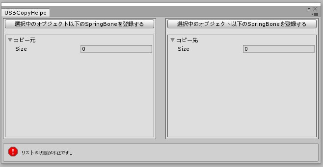

# UnitychanSpringBoneCopyHelper
UnitychanSpringBoneをコピーするエディタ拡張

## 概要
UnitychanSpringBoneを使用してモデルをセットアップ後、モデルの修正を行った際に骨名の変更や改装の変更などによりセーブ＆ロードでは上手く設定の移行できない場合があります。  
そこで古いモデルから新しいモデルへ設定値をコピーしてくれるエディタ拡張を作りました。  

## 使い方
1. [Booth](https://cifertech.booth.pm/items/1852814)からUnityPackageをダウンロードしてインポートする。
1. プロジェクトのScripting Runtime Versionを __.NET4.x（もしくはそれ以上）__ にする。
1. メニューバーより __CIFER.Tech -> UnitychanSpringBoneCopyHelper__ を選択する。
1. 左側にコピー元となるSpringBoneを、右側にコピー先となるSpringBoneを登録する。
1. 一番下に出現する『コピー！』ボタンを押下する。

## 動作環境
- Unity2017.4.28f1
  - Scripting Runtime Version Experimental(.NET 4.6 Equivaient)
- [UnitychanSpringBone](https://github.com/unity3d-jp/UnityChanSpringBone)

## FAQ
### コピー元とコピー先の対応はどうなってるの？
インデックス準拠になっています。  
例えば、コピー元Element0に登録されたSpringBoneは、コピー先Element0に登録されたSpringBoneに設定値をコピーします。

### Nullの時の挙動はどうなってるの？
コピー元もしくはコピー先のSpringBoneが何らかの理由でNullの場合は、該当する要素（インデックス）を飛ばして処理を続行します。

### コピー元とコピー先でSpringBoneの数が違うんだけど
正常にコピーできます。ただし設定値のマージ等は行わないので、コピー後に再度調整する必要があるかと思います。

### コライダーやPivotもコピーしてくれるの？
しません。あくまでも揺れに関する設定値のみコピーします。

## ライセンス
本リポジトリは[MITライセンス](LICENSE)の下で公開しています。

本リポジトリにはMITライセンスの下に提供されている[UnitychanSpringBone](https://github.com/unity3d-jp/UnityChanSpringBone)が含まれています。  
このコンテンツを利用される場合は、[該当リポジトリのライセンス](https://github.com/unity3d-jp/UnityChanSpringBone/blob/master/LICENSE)もしくは同梱しているライセンスファイルに従ってください。  
